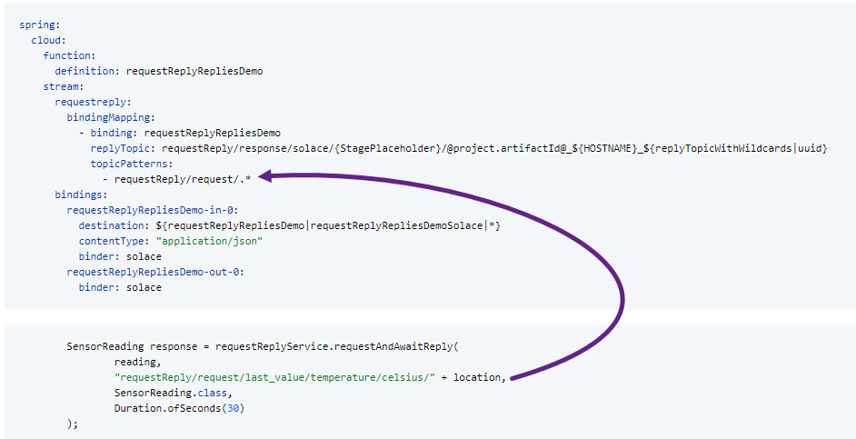
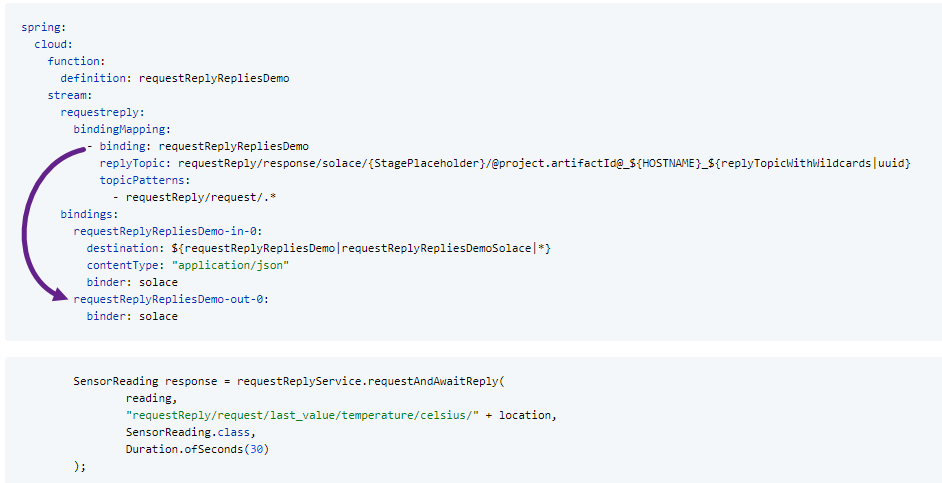
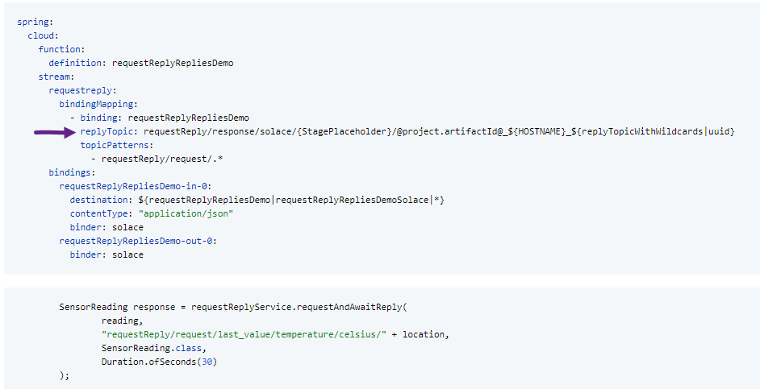
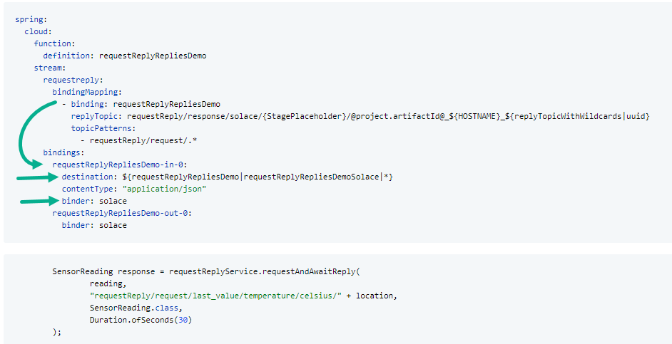
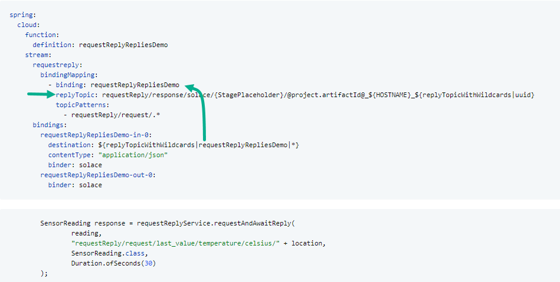

# `spring-boot-starter-request-reply`
## Description
This Spring Boot Starter provides request-reply functionality for [Spring Cloud Stream Binders].

## Spring Cloud Version Compatibility

Consult the table below to determine which version you need to use:

| Spring Cloud | spring-cloud-stream-starter-request-reply | Spring Boot | sol-jcsmp |
|--------------|-------------------------------------------|-------------|-----------|
| 2023.0.2     | 5.1.5                                     | 3.3.0       | 10.24.0   |
| 2023.0.2     | 5.1.4                                     | 3.3.0       | 10.24.0   |
| 2023.0.2     | 5.1.3                                     | 3.3.0       | 10.23.0   |
| 2023.0.1     | 5.1.2                                     | 3.2.5       | 10.23.0   |

## Usage
### Dependencies
To enable the request/reply functionality, please add the following section to your Maven pom.xml

```xml
<dependency>
    <groupId>community.solace.spring.cloud</groupId>
    <artifactId>spring-cloud-stream-starter-request-reply</artifactId>
    <version>5.1.5</version>
</dependency>
```


### Usage

#### For requester

If you want to send a request.
You have to define a topic pattern that matches the topic where you send your requests to,
to define the binding that should be used for these requests.
With the binding, you define the binder, contentType, ...
and the response address where the replier should send the response to.

`spring.cloud.stream.requestreply.bindingMapping[n].binding` have to:
- match an entry in: `spring.cloud.function.definition`
- match `spring.cloud.stream.bindings.XX-in-0` where you defined the binder, contentType, ...

`spring.cloud.stream.requestreply.bindingMapping[n].topicPatterns[m]`:
- Is a list of RegEx patterns that will match against the destination of your requests.
- If there are no matching patterns when execute `requestAndAwaitReplyToTopic()`/`requestReplyToTopic()` and `IllegalArgumentException` will be thrown.
- If you only want to use `requestAndAwaitReplyToBinding()`/`requestReplyToBinding()` you don't need to give this configuration.

Please remember to define this binding as well in the `spring.cloud.function.definition`,
otherwise you will not receive responses.
But you don't need to create a bean for that, this will be generated by the library.

##### Using dynamic topics
```yaml
spring:
  cloud:
    function:
      definition: requestReplyRepliesDemo
    stream:
      requestreply:
        bindingMapping:
          - binding: requestReplyRepliesDemo
            replyTopic: requestReply/response/solace/{StagePlaceholder}/@project.artifactId@_${HOSTNAME}_${replyTopicWithWildcards|uuid}
            topicPatterns:
              - requestReply/request/.*
      bindings:
        requestReplyRepliesDemo-in-0:
          destination: ${replyTopicWithWildcards|requestReplyRepliesDemo|*}
          contentType: "application/json"
          binder: solace
        requestReplyRepliesDemo-out-0:
          binder: solace
```

###### single response
```java
        SensorReading response = requestReplyService.requestAndAwaitReplyToTopic(
                reading,
                "requestReply/request/last_value/temperature/celsius/" + location,
                SensorReading.class,
                Duration.ofSeconds(30)
        );
```

###### multiple responses
Introduction into [Flux/project reactor](https://www.baeldung.com/reactor-core)
```java
        Flux<SensorReading> responses = requestReplyService.requestAndAwaitReplyToTopicReactive(
                reading,
                "requestReply/request/last_value/temperature/celsius/" + location,
                SensorReading.class,
                Duration.ofSeconds(30)
        );
```

##### Using static topics
```yaml
spring:
  cloud:
    function:
      definition: requestReplyRepliesDemo
    stream:
      requestreply:
        bindingMapping:
          - binding: requestReplyRepliesDemo
            replyTopic: requestReply/response/solace/{StagePlaceholder}/@project.artifactId@_${HOSTNAME}_${replyTopicWithWildcards|uuid}
      bindings:
        requestReplyRepliesDemo-in-0:
          destination: ${replyTopicWithWildcards|requestReplyRepliesDemo|*}
          contentType: "application/json"
          binder: solace
        requestReplyRepliesDemo-out-0:
          destination: requestReply/request/last_value/temperature/celsius/livingroom,
          binder: solace
```

###### single response
```java
        SensorReading response = requestReplyService.requestAndAwaitReplyToBinding(
                request,
                "requestReplyRepliesDemo",
                SensorReading.class,
                Duration.ofSeconds(30)
        );
```

###### multiple responses
Introduction into [Flux/project reactor](https://www.baeldung.com/reactor-core)
```java
        Flux<SensorReading> responses = requestReplyService.requestReplyToBindingReactive(
                request,
                "requestReplyRepliesDemo",
                SensorReading.class,
                Duration.ofSeconds(30)
        );
```

[Full example](examples/request_reply_sending/src/main/java/community/solace/spring/cloud/requestreply/examples/sending/controller/RequestReplyController.java)

##### How everything is related

When using `requestAndAwaitReplyToBinding` / `requestReplyToTopic`
The topic use in the code will be matched against all `spring.cloud.stream.requestreply.bindingMapping[].topicPatterns`,
the fist hit will be used.


The `spring.cloud.stream.requestreply.bindingMapping[].binding` of the matching section will be matched against
`spring.cloud.stream.bindings[]` and always out-1 will be used.
This is required to let the requestReply service know what `binder`, `contentType`, ... is to use.


The `spring.cloud.stream.requestreply.bindingMapping[].replyTopic` of the matching section will be placed in the outbound
message to let the foreign service know where you expect the answer.
In general, you want to use here a topic that is unique.
Best practice is to put:
- HOSTNAME into the topic to make debugging a little easier.
- To ensure a unique inbox for your topic, include a UUID directly within it.
  Avoid using `${random.uuid}` from Spring, as this would generate a new UUID each time it is called.
  Instead, use `${replyTopicWithWildcards|uuid}` to get a static UUID that is generated at the start of the process.



The requestReply service will iterate over `spring.cloud.stream.requestreply.bindingMapping`
And create a Bean to consume messages received on `-in-0.destination` using the given binder.


As soon as you use the `{StagePlaceholder}` feature, you cannot listen on:
`requestReply/response/solace/{StagePlaceholder}/pub_sub_sending_K353456_315fd96b-b981-417b-be99-3be065c6611d`
because the foreign side will replace `{StagePlaceholder}` against `p-pineapple`for example before responding.
Therefore, you need to listen to:
`requestReply/response/solace/*/pub_sub_sending_K353456_315fd96b-b981-417b-be99-3be065c6611d`
This task will be done by: `${replyTopicWithWildcards|requestReplyRepliesDemo|*}`
It will take `spring.cloud.stream.requestreply.bindingMapping[].replyTopic` of the section, matching the first parameter.
And replace all `{someThing}` to the wildcard (second parameter) `*`


#### For replier
In general, if you want to respond to a message, you do not need this library.
Instead,
you can send the response to the topic specified in the reply-to header
and replicate all headers from the request to the response.


However, the methods `RequestReplyMessageHeaderSupportService.wrap`, `RequestReplyMessageHeaderSupportService.wrapList`
and `RequestReplyMessageHeaderSupportService.wrapFlux`
from this library can support in creating the response with properly setting the message headers,
as well as with substituting variables in dynamic topics.

By default, the wrapping function will set the correlationId and reply destination headers of the message.
In the case of multi responses, the header for totalReplies and replyIndex will be set as well.
Additional headers can be configured to be copied from the request by
setting `spring.cloud.stream.requestReply.copyHeadersOnWrap` accordingly, e.g.:

```properties
spring.cloud.stream.requestReply.copyHeadersOnWrap=encoding,yetAnotherHeader
```

The actual Wrapping can be used as in the example below:

##### single response
```java
public class PingPongConfig {
  @Bean
  public Function<Message<SensorRequest>, Message<SensorReading>> responseToRequest(
          RequestReplyMessageHeaderSupportService headerSupport
  ) {
    return headerSupport.wrap((request) -> {
      SensorReading response = new SensorReading();
      response.setFoo(1337);

      return response;
    });
  }
}
```
[Full example](examples/request_reply_response/src/main/java/community/solace/spring/cloud/requestreply/examples/response/config/PingPongConfig.java)

##### multiple responses, functional
```java
public class PingPongConfig {
  @Bean
  public Function<Message<SensorRequest>, List<Message<SensorReading>>> responseMultiToRequestKnownSizeSolace(
          RequestReplyMessageHeaderSupportService headerSupport
  ) {
    return headerSupport.wrapList((request) -> {
      List<SensorReading> responses = new ArrayList<>();
      responses.add(new SensorReading());
      // ....

      return responses;
    }, "responseMultiToRequestKnownSizeSolace-out-0");
  }
}
```
[Full example](examples/request_reply_response/src/main/java/community/solace/spring/cloud/requestreply/examples/response/config/PingMultiPongConfig.java)

##### multiple responses, reactive
```java
public class PingPongConfig {
  @Bean
  public Function<Flux<Message<SensorRequest>>, Flux<Message<SensorReading>>> responseMultiToRequestRandomSizeSolace(
          RequestReplyMessageHeaderSupportService headerSupport
  ) {
    return headerSupport.wrapFlux((request, responseSink) -> {
      try {
        while (yourBusinessLogic) { // Your business logic can submit 0 to N responses.
          responseSink.next(response);
        }
        responseSink.complete();
      } catch (Exception e) {
        responseSink.error(new IllegalArgumentException("Business error message", e));
      }
    }, "responseMultiToRequestRandomSizeSolace-out-0");
  }
}
```
[Full example](examples/request_reply_response/src/main/java/community/solace/spring/cloud/requestreply/examples/response/config/PingMultiPongConfig.java)

##### error handling
You might want to forward errors to requester.
To forward errors, you only need to define 1 to N exception classes that should be forwarded to the requestor.

```java
public class PingPongConfig {
  @Bean
  public Function<Message<SensorRequest>, Message<SensorReading>> responseToRequest(
          RequestReplyMessageHeaderSupportService headerSupport
  ) {
    return headerSupport.wrap((request) -> {
      SensorReading response = new SensorReading();
      response.setFoo(1337);

      return response;
    }, MyBusinessException.class, SomeOtherException.class);
  }
}
```

Input class validation and JSON parsing cannot be returned to the requester out of the box.
Therefore, you need to do the validation on your own like:

```java
public class PingPongConfig {
  @Qualifier("mvcValidator")
  private final Validator validator;

  private final ObjectMapper objectMapper;

  @Bean
  public Function<Message<String>, Message<SensorReading>> responseToRequest(
          RequestReplyMessageHeaderSupportService headerSupport
  ) {
    return headerSupport.wrap((rawRequest) -> {
      SensorReading request = objectMapper.readValue(rawRequest.getPayload(), SensorReading.class);
      final DataBinder db = new DataBinder(request);
      db.setValidator(validator);
      db.validate();


      SensorReading response = new SensorReading();
      response.setFoo(1337);

      return response;
    }, MyBusinessException.class, SomeOtherException.class);
  }
}
```

##### Variable replacement

The requestor may include placeholders in the reply destination.
These placeholders must be replaced before sending the response.

A possible use case for this feature is
when there are multiple instances available to process the response for load-balancing or data center redundancy reasons.
In such scenarios, it can be helpful for debugging purposes to know how messages are processed.

For instance, the request might contain the placeholder `{StagePlaceholder}` in the reply destination header.

Here’s an example configuration to replace the `{StagePlaceholder}` term with a unique identifying string:

```yaml
spring:
  cloud:
    function:
      definition: requestReplyRepliesDemo
    stream:
      requestreply:
        variableReplacements:
          "{StagePlaceholder}": ${RCS_ENV_ROLE}-${RCS_CLUSTER}
```

Those `variableReplacements` will be applied to request and reply topics.

##### Configure custom logging
In case the standard logging is not matching your expectations,
you can define your own logging spring bean to customize logging behavior.

```java
@Configuration
public class CustomizedLoggerConfig {

    @Bean
    public RequestReplyLogger requestReplyLogger() {
        return new CustomizedLogger();
    }
}
```
Example logger interface implementation:
```java
public class CustomizedLogger implements RequestReplyLogger {

    @Override
    public void logRequest(Logger logger, Level suggestedLevel, String suggestedLogMessage, Message<?> message) {
        logger.atLevel(Level.DEBUG).log("<<< {} {}", message.getPayload(), message.getHeaders());
    }

    @Override
    public void logReply(Logger logger, Level suggestedLevel, String suggestedLogMessage, long remainingReplies, Message<?> message) {
        String payloadString = new String((byte[])message.getPayload());
        logger.atLevel(Level.DEBUG).log(">>> {} {} remaining replies: {}", payloadString, message.getHeaders(), remainingReplies);
    }

    @Override
    public void log(Logger logger, Level suggestedLevel, String suggestedLogMessage, Object... formatArgs) {
        logger.atLevel(suggestedLevel).log(suggestedLogMessage, formatArgs);
    }
}
```

You find an entire example-application for the purpose of showing how to configure this under examples/customized_logging.

##### Configure custom message interception
If you need to modify a request-message before it is sent by the request side, you can define an interceptor bean
for the interface "RequestSendingInterceptor".
You can find an entire example tho this under "examples/customized_reply_to_header_sending".

On the responder side, if you need to change a message while it is being wrapped,
you can define an interceptor bean for the interface "ReplyWrappingInterceptor".
You can find an entire example tho this under "examples/customized_reply_to_header_response".

### API

#### `RequestReplyService`

The request/reply functionality
provided by this starter can be used by autowiring the `RequestReplyService` which offers the following methods:

#### for single response

If you expect exactly one response.

- The method `A requestAndAwaitReplyToTopic(Q request, String requestDestination, Class<A> expectedResponseClass, Duration timeoutPeriod)`
  sends the specified request to the designated request destination,
  waits for the response, and maps it to the provided class as the return value.
  If a `-out-0.destination` is configured, it will be ignored.

- The method `A requestAndAwaitReplyToBinding(Q request, String bindingName, Class<A> expectedResponseClass, Duration timeoutPeriod)`
  sends the specified request to the destination configured for the `-out-0` of this binding,
  waits for the response, and maps it to the provided class as the return value.
  If a `-out-0.destination` is configured, it will be ignored.

- The method `CompletableFuture<A> requestReplyToTopic(Q request, String requestDestination, Class<A> expectedClass, Duration timeoutPeriod)`
  sends the specified request to the designated request destination.
  It returns a future that maps the received response to the provided class.
  Use this method only in rare edge cases
  where you need to execute multiple request-reply operations in parallel within the same thread.

- The method `CompletableFuture<A> requestReplyToBinding(Q request, String bindingName, Class<A> expectedClass, Duration timeoutPeriod)`
  sends the specified request to the destination configured for the `-out-0` of this binding.
  It returns a future that maps the received response to the provided class.
  Use this method only in rare edge cases
  where you need to execute multiple request-reply operations in parallel within the same thread.

#### for multi response

If you expect zero to N responses.

- The method `Flux<A> requestReplyToTopicReactive(Q request, String requestDestination, Class<A> expectedClass, Duration timeoutPeriod)`
  sends the specified request to the designated request destination.
  It returns a reactive stream that maps the received responses to the provided class.
  Use this method when you expect multiple responses for a single question.
  If your response type is an array,
  it is advisable to send the elements as individual messages to avoid exceeding the message size limit.

- The method `Flux<A> requestReplyToBindingReactive(Q request, String bindingName, Class<A> expectedClass, Duration timeoutPeriod)`
  sends the specified request to the destination configured for the `-out-0` of this binding.
  It returns a reactive stream that maps the received responses to the provided class.
  Use this method when you expect multiple responses for a single query.
  If your response type is an array,
  it is recommended to send the elements as individual messages to prevent exceeding the message size limit.

###### Example for blocking

A blocking request reply where you receive a list of answers.

```java
    @GetMapping(value = "/temperature/last_hour/{location}")
    public List<SensorReading> requestMultiReplySample(
            @PathVariable("location") final String location
    ) {
        MyRequest request = new MyRequest();
        request.setLocation(location);

        return requestReplyService.requestReplyToTopicReactive(
                        request,
                        "last_hour/temperature/celsius/" + location,
                        SensorReading.class,
                        Duration.ofSeconds(30)
                )
                .collectList()
                .block();
    }
```

###### Example for non-blocking

A blocking request reply where you receive a list of answers.

```java
    @GetMapping(value = "/temperature/last_hour/{location}")
    public void requestMultiReplySample(
            @PathVariable("location") final String location
    ) {
        MyRequest request = new MyRequest();
        request.setLocation(location);

        requestReplyService.requestReplyToTopicReactive(
                        request,
                        "last_hour/temperature/celsius/" + location,
                        SensorReading.class,
                        Duration.ofSeconds(30)
                )
                .subscribe(
                        sensorReading -> log.info("Got an answer: " + sensorReading),
                        throwable -> log.error("The request was finished with error", throwable),
                        () -> log.info("The request was finished")
                );
    }
```

###### receive many answers

If your request is a `org.springframework.messaging.Message`, you can decide if every response should be
transported as a single message or if a couple of messages should be grouped together.

Message grouping can be enabled via:
`requestMsg.setHeader(SpringHeaderParser.GROUPED_MESSAGES, true);`

In case you request something else, will the request/reply lib add `GROUPED_MESSAGES=true` automatically.

Until you require a separate header for each reply,
it is recommended to use grouped messages instead of sending individual messages.
Grouped messages improve reply speed by reducing the message header overhead and conserving broker resources.

Messages will be grouped together until one of the following conditions is met:
- The grouped message exceeds the 1MB limit
- The group contains more than 10_000 individual messages
- The first message in the group was sent more than 0.5 seconds ago (or a different threshold configured by the replier).


#### `RequestReplyMessageHeaderSupportService`

If a service only responds to requests,
this library can still be used as it provides helper methods for receiving services.
These methods wrap response functions using the `RequestReplyMessageHeaderSupportService`,
which appropriately sets the Message's destination header.
This header can then be accessed through Spring Cloud Functions.
For example:

```java
    @Bean
    @Autowired
    public Function<Message<String>, Message<String>> reverse(RequestReplyMessageHeaderSupportService headerSupport) {
        return headerSupport.wrap((value) -> new StringBuilder(value).reverse().toString());
    }
```

## Extensibility

The Request/Reply Spring Boot Starter has been designed
to work with both the [Solace Binder](https://github.com/SolaceProducts/solace-spring-cloud) and the [TestSupportBinder](https://github.com/spring-cloud/spring-cloud-stream/blob/main/spring-cloud-stream-test-support/src/main/java/org/springframework/cloud/stream/test/binder/TestSupportBinder.java),
but can be extended to work with other binders as well.

For that, the following beans must be provided to be able to adapt to another binder.

### Message and MessageHeader parsers

When receiving messages, the application must be able to determine correlationId, destination and replyTo properties attached to a message. Unless a particular binder adheres to spring messaging standards or requires differing headers for performance optimizations, additional message parsers (or related message header parsers) must be present. For proper prioritization the bean should be annotated with the `@Order` annotation. (see [@Order in Spring @Baeldung])


The Starter includes the following message parser interfaces:

- `MessageCorrelationIdParser` - root interface for parsing the correlation id from an incoming message
  - `MessageHeaderCorrelationIdParser` - extended interface for parsing the correlation id from an incoming message's MessageHeaders
- `MessageDestinationParser` - root interface for parsing the destination from an incoming message
  - `MessageHeaderDestinationParser`- extended interface for parsing the destination from an incoming message's MessageHeaders
- `MessageReplyToParser` - root interface for parsing the reply destination from an incoming message
  - `MessageHeaderReplyToParser` - extended interface for parsing the reply destination from an incoming message's MessageHeaders
- `MessageTotalRepliesParser` - root interface for parsing the total replies for from an incoming multi response message
  - `MessageHeaderTotalRepliesParser` - extended interface for parsing the total replies from an incoming multi response message's MessageHeaders


The starter also includes the following message parser implementations:

- `SolaceHeaderParser`  _Order: 200_
  implements `MessageHeaderCorrelationIdParser`,  `MessageHeaderDestinationParser`, `MessageHeaderReplyToParser` for the Solace binder
- `SpringCloudStreamHeaderParser` _Order 10000_
  implements `MessageHeaderDestinationParser`, `MessageTotalRepliesParser` for standard Spring Cloud Stream headers
- `SpringIntegrationHeaderParser` _Order 20000_
  implements `MessageHeaderCorrelationIdParser` for standard Spring Integration headers
- `BinderHeaderParser` _Order 30000_
  implements `MessageHeaderDestinationParser` for standard Spring Cloud Stream Binder headers
- `SpringHeaderParser` _Order 40000_
  implements `MessageHeaderReplyToParser` for Spring Framework message header standards
- `HttpHeaderParser` _Order LOWEST_PRECEDENCE_
  implements `MessageHeaderCorrelationIdParser` according to the HTTP header standard


## Known issues and Open Points

### Statefulness
Since message relations are kept in memory, this starter is neither fail-safe nor scalable.

More precisely:
- If one instance of the service sends a message and another one receives the response, these cannot be related.
- If a service dies, any relations are forgotten and replies can no longer be related to request,
  potentially resulting in message loss.

## External Links
- [Spring Cloud Stream Solace Samples](https://solace.com/samples/solace-samples-spring/spring-cloud-stream/)


## Compatibility

Tested with:

| SpringBoot 	 | SpringCloudStream 	  |
|--------------|----------------------|
| 2.6.6      	 | 2021.0.1          	  |
| 2.6.6      	 | 2021.0.3           	 |
| 3.2.5        | 2023.0.1           	 |

<!-- reused links -->

[@Order in Spring @Baeldung]: https://www.baeldung.com/spring-order
[Spring Cloud Stream Binders]: https://docs.spring.io/spring-cloud-stream/docs/current/reference/html/spring-cloud-stream.html#spring-cloud-stream-overview-binders

