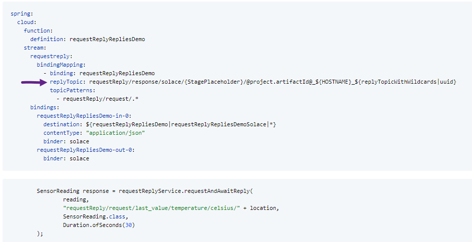
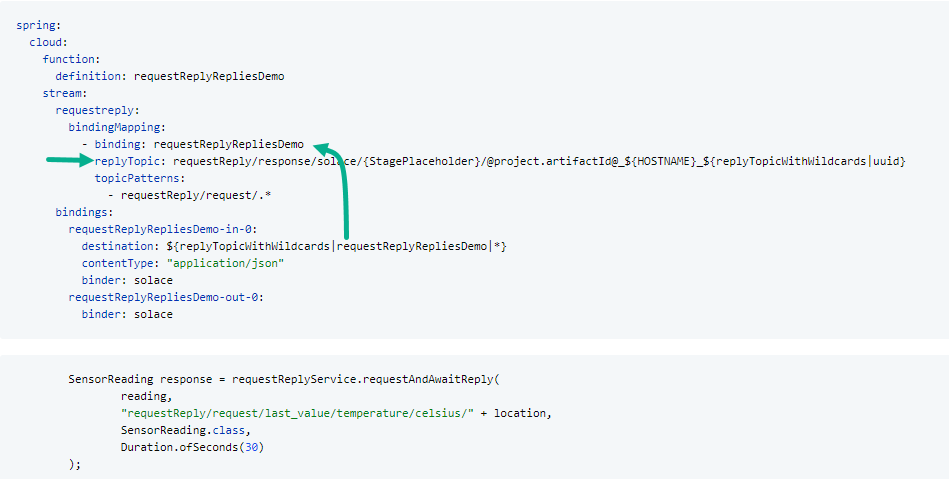
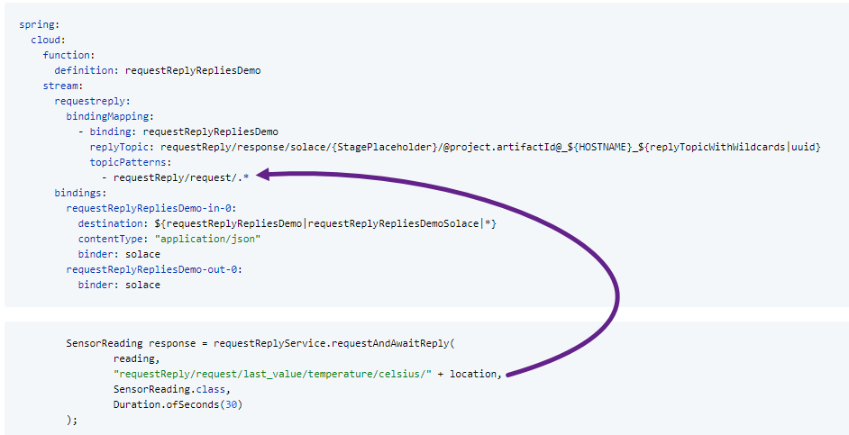
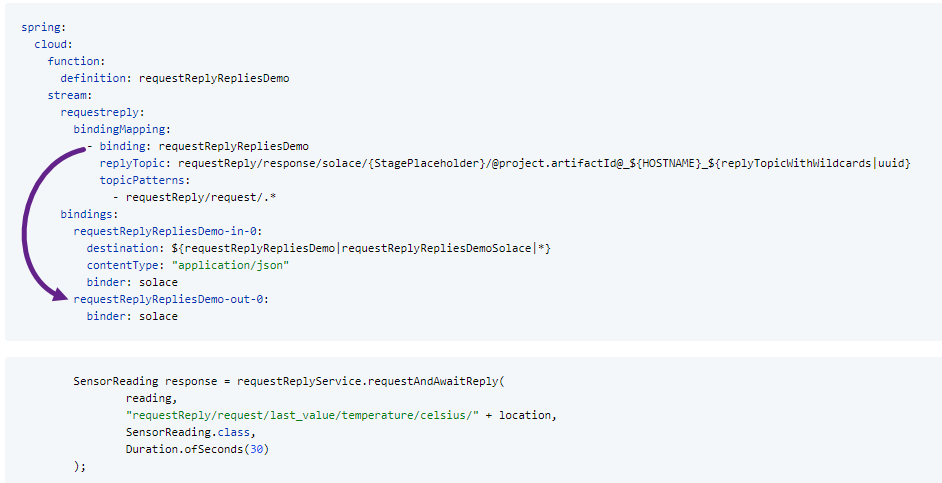
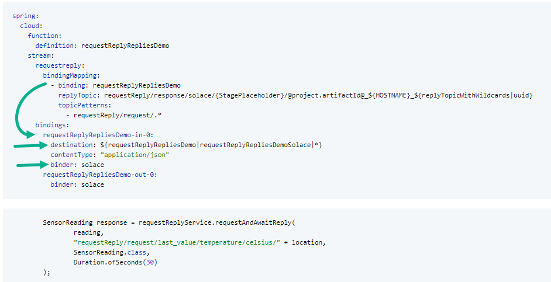

# Spring Cloud Stream Request/Reply

> Synchronous **request/reply** (and request / multi‑reply) semantics on top of
> [Spring Cloud Stream](https://spring.io/projects/spring-cloud-stream) — primarily for the
> [Solace PubSub+](https://github.com/SchweizerischeBundesbahnen/spring-cloud-stream-binder) binder, but pluggable for others.

[](https://central.sonatype.com/artifact/community.solace.spring.cloud/spring-cloud-stream-starter-request-reply)
[](https://github.com/solacecommunity/spring-cloud-stream-request-reply/actions/workflows/validate.yml)
[](LICENSE)

## Overview

Message brokers are inherently asynchronous and fire‑and‑forget: you publish a message to a topic and
you do not, by default, get an answer back. Many use cases, however, are naturally
**request/reply** — "ask a question, wait for the answer" — for example querying the last sensor
reading for a location, or fanning a query out to many responders and collecting their results.

This Spring Boot starter adds that request/reply layer on top of Spring Cloud Stream. As the caller you
get a plain, synchronous (or reactive) method call; under the hood the library:

- generates a **correlation id** for the request,
- publishes it to your request destination with a **reply‑to** topic that is unique to your process,
- **correlates** the incoming reply(ies) back to the original call, and
- returns the result to you (blocking, as a `CompletableFuture`, or as a reactive `Flux`) — or throws a
  `TimeoutException` if no answer arrives within the timeout you specified.

It supports both **single response** ("one question → one answer") and **request / multi‑reply**
("one question → zero to N answers") patterns, with optional error propagation from the responder back
to the caller.

## Features

- Synchronous request/reply as a single method call (`requestAndAwaitReplyToTopic` / `…ToBinding`).
- Non‑blocking variants returning `CompletableFuture` or reactive `Flux`.
- **Request / multi‑reply**: receive zero to N answers for one request.
- Per‑request **timeouts** and automatic cleanup of in‑flight bookkeeping.
- Automatic **correlation id** generation and reply‑to routing.
- Helper methods (`wrap`, `wrapList`, `wrapFlux`) for the responder side that set the reply headers for
  you and can **forward selected exceptions** back to the requester.
- **Message grouping** for large multi‑reply result sets to reduce broker/header overhead.
- **Reply deduplication** by `replyIndex` to survive duplicate delivery (e.g. broker reconnects).
- **Micrometer context propagation** (tracing / MDC) across the internal asynchronous pipeline.
- Pluggable **message / header parsers** to adapt to binders other than Solace.
- Customizable **logging** and request/reply **message interceptors**.

## Compatibility

The starter builds on Spring Boot, Spring Cloud Stream and the Solace `sol-jcsmp` client. Pick the
version that matches your Spring Cloud release train:

| Spring Cloud | spring-cloud-stream-starter-request-reply | Spring Boot | sol-jcsmp |
|--------------|-------------------------------------------|-------------|-----------|
| 2025.1.2     | 6.1.1                                     | 4.1.0       | 10.30.1   |
| 2025.1.2     | 6.1.0                                     | 4.1.0       | 10.30.1   |
| 2025.1.1     | 6.0.1                                     | 4.0.5       | 10.29.0   |
| 2025.1.1     | 6.0.0                                     | 4.0.2       | 10.29.0   |
| 2025.0.0     | 5.3.5                                     | 3.5.8       | 10.29.0   |
| 2025.0.0     | 5.3.4                                     | 3.5.8       | 10.29.0   |
| 2025.0.0     | 5.3.3                                     | 3.5.8       | 10.29.0   |
| 2025.0.0     | 5.3.2                                     | 3.5.8       | 10.29.0   |
| 2025.0.0     | 5.3.1                                     | 3.5.6       | 10.28.1   |
| 2025.0.0     | 5.2.4, 5.3.0                              | 3.5.4       | 10.27.3   |
| 2024.0.0     | 5.2.3                                     | 3.4.2       | 10.25.2   |
| 2024.0.0     | 5.2.2                                     | 3.4.2       | 10.25.2   |
| 2023.0.2     | 5.1.5                                     | 3.3.0       | 10.24.0   |
| 2023.0.2     | 5.1.4                                     | 3.3.0       | 10.24.0   |
| 2023.0.2     | 5.1.3                                     | 3.3.0       | 10.23.0   |
| 2023.0.1     | 5.1.2                                     | 3.2.5       | 10.23.0   |

Java 17+ is required.

## Getting started

### 1. Add the dependency

```xml
<dependency>
    <groupId>community.solace.spring.cloud</groupId>
    <artifactId>spring-cloud-stream-starter-request-reply</artifactId>
    <version>6.1.1</version>
</dependency>
```

The starter is auto‑configured; adding it to the classpath is enough to expose the
`RequestReplyService` and `RequestReplyMessageHeaderSupportService` beans. You still need a Spring
Cloud Stream binder on the classpath (e.g. the Solace binder) and the usual binder configuration.

### 2. Send a request (requester side)

Autowire `RequestReplyService` and call it:

```java
SensorReading response = requestReplyService.requestAndAwaitReplyToTopic(
        reading,                                            // the request payload
        "last_value/temperature/celsius/" + location,       // where to send the request
        SensorReading.class,                                // how to map the reply
        Duration.ofSeconds(30)                              // give up after 30s
);
```

[Full example](examples/request_reply_sending/src/main/java/community/solace/spring/cloud/requestreply/examples/sending/controller/RequestReplyController.java)

### 3. Reply to a request (responder side)

A responder is an ordinary Spring Cloud Function; wrap it with
`RequestReplyMessageHeaderSupportService` so the correct reply headers are set automatically:

```java
@Bean
public Function<Message<SensorRequest>, Message<SensorReading>> responseToRequest(
        RequestReplyMessageHeaderSupportService headerSupport
) {
    return headerSupport.wrap(request -> {
        SensorReading response = new SensorReading();
        response.setTemperature(21.5);
        return response;
    });
}
```

[Full example](examples/request_reply_response/src/main/java/community/solace/spring/cloud/requestreply/examples/response/config/PingPongConfig.java)

The [`examples/`](examples) directory contains full runnable applications for the requester and
responder sides, custom logging and custom reply‑to header handling.

## How it works

The request destination, the binding, and the reply‑to topic are wired together through three
configuration keys. Understanding how they relate makes the configuration below straightforward.

### Correlation

Each request carries a **correlation id**. If your request is a plain payload, the library generates a
random UUID; if it is already a `org.springframework.messaging.Message` that carries a correlation id,
that id is reused. Every reply must echo the correlation id so the requester can match it to the
pending call. Correlation ids and other metadata are read from messages by an ordered chain of
**header parsers** (see [Extending to other binders](#extending-to-other-binders)).

### Reply‑to and dynamic reply topics

The requester tells the responder where to answer by putting a **reply‑to** topic into the outgoing
message (`spring.cloud.stream.requestreply.bindingMapping[].replyTopic`). This topic should be unique
per process so that replies come back only to the instance that asked. Best practice:

- include the `HOSTNAME` to make debugging easier, and
- include a **process‑stable UUID** via `${replyTopicWithWildcards|uuid}`. Do **not** use Spring's
  `${random.uuid}` here — it produces a new UUID on every reference. `${replyTopicWithWildcards|uuid}`
  is generated once at process start.



Because a reply topic may contain `{placeholder}` segments that the responder substitutes before
answering (see [Variable replacement](#variable-replacement)), the requester cannot subscribe to the
literal topic it published. A `replyTopic` such as

```
requestReply/response/solace/{StagePlaceholder}/pub_sub_sending_K353456_315fd96b-b981-417b-be99-3be065c6611d
```

arrives with `{StagePlaceholder}` already replaced by the responder — with `p-pineapple`, for
example — so the requester has to listen on a **wildcarded** version of it:

```
requestReply/response/solace/*/pub_sub_sending_K353456_315fd96b-b981-417b-be99-3be065c6611d
```

The `${replyTopicWithWildcards|<binding>|*}` placeholder does exactly that: it takes the `replyTopic`
of the named binding and replaces every `{placeholder}` with the wildcard you pass (`*` for Solace).



### Routing a request through a binding

When you call `requestAndAwaitReplyToTopic(...)` / `requestReplyToTopicReactive(...)`, the request topic
is matched against every `bindingMapping[].topicPatterns` (regular expressions); the **first match**
selects the binding.



The selected `bindingMapping[].binding` is used to look up `…-out-0` so the library knows which
`binder`, `contentType`, etc. to use for sending. (When you send to a topic, any configured
`…-out-0.destination` is ignored — the topic you passed wins.)



For each configured `bindingMapping`, the library also registers a reply consumer on `…-in-0` so that
incoming replies are routed back to the pending request. You do **not** need to declare this consumer
function yourself — but you **must** list the binding name in `spring.cloud.function.definition`.



### Timeouts

Every method takes a `Duration timeoutPeriod`. The request is sent and the reply awaited on a shared
executor; if no (final) reply arrives in time the pending request is aborted and a `TimeoutException`
is raised. Bookkeeping for the request is always cleaned up on success, error or timeout.

### Single vs. multi response

- **Single response** — you expect exactly one answer. Use `requestAndAwaitReply*` (blocking) or
  `requestReplyTo*` (returns a `CompletableFuture`).
- **Multi response** — you expect zero to N answers. Use `requestReplyTo*Reactive`, which returns a
  `Flux`. The responder signals completion with a terminal (empty) message and the total number of
  replies, so the requester knows when the stream is done.

For large multi‑reply result sets, replies can be **grouped**: instead of one broker message per
answer, the responder packs several answers into a single message. Grouping is enabled automatically
when your request is not a `Message`; if it is, switch grouping on with the `groupedMessages` header:

```java
Message<MyRequest> requestMsg = MessageBuilder.withPayload(request)
        .setHeader(SpringHeaderParser.GROUPED_MESSAGES, true)
        .build();
```

Unless you need separate headers per reply, prefer grouped messages: they make replies faster because
they save message header overhead and broker resources. A group is flushed when any of these is
reached:

- the grouped message would exceed **1 MB**,
- the group reaches **10 000** individual messages, or
- the first message in the group is older than the responder's group timeout (default **200 ms**,
  configurable in `wrapFlux`).

### Reply deduplication

In some operational scenarios (e.g. in‑place broker updates, short disconnects/reconnects) the same
request may be delivered twice and the responder may therefore emit **duplicate replies**. The
requester deduplicates incoming replies by `replyIndex`:

- duplicate `replyIndex` values are processed only once (including range indices such as `"0-45"` used
  for grouped replies),
- terminal messages (finish/error) are always processed, even when they share a `replyIndex`.

When `totalReplies` is not yet known (streaming/unknown‑size patterns), numeric `replyIndex` values are
still deduplicated up to a bounded bitmap size (see [Configuration](#configuration)).

## Configuration

A complete requester + responder configuration ties four things together for each binding:

1. the binding name appears in `spring.cloud.function.definition`,
2. `spring.cloud.stream.requestreply.bindingMapping[]` defines the `replyTopic` (and optional
   `topicPatterns`),
3. `spring.cloud.stream.bindings.<binding>-in-0` defines where replies are consumed, and
4. `spring.cloud.stream.bindings.<binding>-out-0` defines the binder used to send.

### Dynamic topics (send to a topic chosen at call time)

```yaml
spring:
  cloud:
    function:
      definition: requestReplyRepliesDemo
    stream:
      requestreply:
        bindingMapping:
          - binding: requestReplyRepliesDemo
            replyTopic: requestReply/response/solace/{StagePlaceholder}/@project.artifactId@_${HOSTNAME}_${replyTopicWithWildcards|uuid}
            topicPatterns:
              - requestReply/request/.*
      bindings:
        requestReplyRepliesDemo-in-0:
          destination: ${replyTopicWithWildcards|requestReplyRepliesDemo|*}
          contentType: "application/json"
          binder: solace
        requestReplyRepliesDemo-out-0:
          binder: solace
```

Single response:

```java
SensorReading response = requestReplyService.requestAndAwaitReplyToTopic(
        reading,
        "requestReply/request/last_value/temperature/celsius/" + location,
        SensorReading.class,
        Duration.ofSeconds(30)
);
```

Multiple responses (reactive):

```java
Flux<SensorReading> responses = requestReplyService.requestReplyToTopicReactive(
        reading,
        "requestReply/request/last_value/temperature/celsius/" + location,
        SensorReading.class,
        Duration.ofSeconds(30)
);
```

### Static topics (send to the binding's configured destination)

Omit `topicPatterns` and configure `…-out-0.destination`, then address the request by **binding name**:

```yaml
spring:
  cloud:
    function:
      definition: requestReplyRepliesDemo
    stream:
      requestreply:
        bindingMapping:
          - binding: requestReplyRepliesDemo
            replyTopic: requestReply/response/solace/{StagePlaceholder}/@project.artifactId@_${HOSTNAME}_${replyTopicWithWildcards|uuid}
      bindings:
        requestReplyRepliesDemo-in-0:
          destination: ${replyTopicWithWildcards|requestReplyRepliesDemo|*}
          contentType: "application/json"
          binder: solace
        requestReplyRepliesDemo-out-0:
          destination: requestReply/request/last_value/temperature/celsius/livingroom
          binder: solace
```

```java
SensorReading response = requestReplyService.requestAndAwaitReplyToBinding(
        request,
        "requestReplyRepliesDemo",
        SensorReading.class,
        Duration.ofSeconds(30)
);
```

### Property reference

All properties live under `spring.cloud.stream.requestreply`:

| Property | Type | Description |
|----------|------|-------------|
| `bindingMapping[].binding` | String | Binding name. Must appear in `spring.cloud.function.definition` and match `spring.cloud.stream.bindings.<binding>-in-0`/`-out-0`. |
| `bindingMapping[].replyTopic` | String | Reply‑to topic placed on outgoing requests. Should be unique per process (host + process‑stable UUID). Required. |
| `bindingMapping[].topicPatterns` | List&lt;RegEx&gt; | Patterns matched against the request destination in `requestReplyTo*Topic*` calls. First match wins. Not needed if you only use the `…ToBinding` methods. |
| `variableReplacements` | Map&lt;String,String&gt; | `{key}` placeholders replaced with the mapped value in request and reply topics. |
| `copyHeadersOnWrap` | List&lt;String&gt; | Additional request headers to copy onto the reply when using the `wrap*` helpers. |

Reply topic placeholders contributed by this starter (usable anywhere in the environment):

| Placeholder | Meaning |
|-------------|---------|
| `${replyTopicWithWildcards\|uuid}` | A UUID generated **once** at process start (unlike `${random.uuid}`). |
| `${replyTopicWithWildcards\|<binding>\|<wildcard>}` | The named binding's `replyTopic` with every `{placeholder}` replaced by `<wildcard>` (`*` for Solace). Use this for `…-in-0.destination`. |

Dedup bitmap bound for unknown/streaming reply counts is read as a **JVM system property** (default
`100000`), for example:

```
-Dspring.cloud.stream.requestreply.dedup.maxBitsWhenUnknown=100000
```

Any `replyIndex` (or range end) above this bound is not deduplicated.

## API reference

### `RequestReplyService`

Autowire this bean to send requests. All methods are generic in the request type `Q` and response type
`A`, take an `expectedClass` the reply is mapped to and a `Duration timeoutPeriod`, and have an overload
that accepts a `Map<String, Object> additionalHeaders`.

**Single response**

| Method | Returns | Notes |
|--------|---------|-------|
| `requestAndAwaitReplyToTopic(request, requestDestination, expectedClass, timeout)` | `A` | Blocks. `requestDestination` is matched against `topicPatterns`. Any `-out-0.destination` is ignored. |
| `requestAndAwaitReplyToBinding(request, bindingName, expectedClass, timeout)` | `A` | Blocks. Sends to the destination configured for the binding's `-out-0`. |
| `requestReplyToTopic(request, requestDestination, expectedClass, timeout)` | `CompletableFuture<A>` | Non‑blocking. Use only when you need parallel request/reply on the same thread. |
| `requestReplyToBinding(request, bindingName, expectedClass, timeout)` | `CompletableFuture<A>` | Non‑blocking. Use only when you need parallel request/reply on the same thread. |

**Multi response (zero to N answers)**

| Method | Returns | Notes |
|--------|---------|-------|
| `requestReplyToTopicReactive(request, requestDestination, expectedClass, timeout)` | `Flux<A>` | Request destination matched against `topicPatterns`. |
| `requestReplyToBindingReactive(request, bindingName, expectedClass, timeout)` | `Flux<A>` | Sends to the binding's `-out-0` destination. |

If your response type is a collection, send its elements as separate replies rather than one large
payload — that keeps you below the broker's message size limit, and grouping will pack them again.

The blocking methods declare `InterruptedException`, `TimeoutException` and `RemoteErrorException`;
`RemoteErrorException` is thrown when the responder forwarded an application error (see below).

Blocking example that collects a list of answers:

```java
@GetMapping(value = "/temperature/last_hour/{location}")
public List<SensorReading> requestMultiReplySample(@PathVariable("location") final String location) {
    MyRequest request = new MyRequest();
    request.setLocation(location);

    return requestReplyService.requestReplyToTopicReactive(
                    request,
                    "last_hour/temperature/celsius/" + location,
                    SensorReading.class,
                    Duration.ofSeconds(30)
            )
            .collectList()
            .block();
}
```

Non‑blocking example:

```java
requestReplyService.requestReplyToTopicReactive(
                request,
                "last_hour/temperature/celsius/" + location,
                SensorReading.class,
                Duration.ofSeconds(30)
        )
        .subscribe(
                sensorReading -> log.info("Got an answer: " + sensorReading),
                throwable -> log.error("The request finished with error", throwable),
                () -> log.info("The request finished")
        );
```

### `RequestReplyMessageHeaderSupportService`

For a pure responder you do not strictly need this library — you could copy the reply‑to header and
correlation id onto your response yourself. The `wrap*` helpers do this for you: they set the
correlation id and reply destination header, substitute `{placeholder}` variables, and (for multi
responses) set the `totalReplies` and `replyIndex` headers. Additional request headers can be copied
onto the reply via `spring.cloud.stream.requestreply.copyHeadersOnWrap`:

```properties
spring.cloud.stream.requestreply.copyHeadersOnWrap=encoding,yetAnotherHeader
```

**Single response** — return `null` from the wrapped function to drop the message (no reply sent):

```java
@Bean
public Function<Message<SensorRequest>, Message<SensorReading>> responseToRequest(
        RequestReplyMessageHeaderSupportService headerSupport
) {
    return headerSupport.wrap(request -> {
        SensorReading response = new SensorReading();
        response.setTemperature(21.5);
        return response;
    });
}
```

[Full example](examples/request_reply_response/src/main/java/community/solace/spring/cloud/requestreply/examples/response/config/PingPongConfig.java)

**Multiple responses, known size** (`wrapList`) — pass the output binding name so grouping and content
type can be resolved:

```java
@Bean
public Function<Message<SensorRequest>, List<Message<SensorReading>>> responseMultiToRequestKnownSize(
        RequestReplyMessageHeaderSupportService headerSupport
) {
    return headerSupport.wrapList(request -> {
        List<SensorReading> responses = new ArrayList<>();
        // ... add responses ...
        return responses;
    }, "responseMultiToRequestKnownSize-out-0");
}
```

**Multiple responses, streaming/unknown size** (`wrapFlux`) — emit 0 to N responses through the sink:

```java
@Bean
public Function<Flux<Message<SensorRequest>>, Flux<Message<SensorReading>>> responseMultiToRequestRandomSize(
        RequestReplyMessageHeaderSupportService headerSupport
) {
    return headerSupport.wrapFlux((request, responseSink) -> {
        try {
            while (moreData) {                 // your business logic can submit 0..N responses
                responseSink.next(response);
            }
            responseSink.complete();
        } catch (Exception e) {
            responseSink.error(new IllegalArgumentException("Business error message", e));
        }
    }, "responseMultiToRequestRandomSize-out-0");
}
```

[Full example for both multi‑response styles](examples/request_reply_response/src/main/java/community/solace/spring/cloud/requestreply/examples/response/config/PingMultiPongConfig.java)

**Forwarding errors to the requester.** Pass one or more exception classes to the `wrap*` helpers; if
the wrapped function throws a matching exception, the error message is sent back to the requester, which
then throws a `RemoteErrorException` (for streaming replies the error terminates the `Flux`):

```java
return headerSupport.wrap(request -> {
    // ...
    return response;
}, MyBusinessException.class, SomeOtherException.class);
```

> Input validation and JSON parsing errors cannot be forwarded automatically — perform validation
> inside the wrapped function (e.g. with a `DataBinder`/`Validator`) and throw one of your forwarded
> exception types.

## Advanced usage

### Variable replacement

A requester may embed `{placeholder}` segments in the reply destination (useful, for example, to encode
which instance/data center should process a load‑balanced reply). The responder substitutes them before
answering:

```yaml
spring:
  cloud:
    stream:
      requestreply:
        variableReplacements:
          "{StagePlaceholder}": ${RCS_ENV_ROLE}-${RCS_CLUSTER}
```

`variableReplacements` are applied to both request and reply topics.

### Custom logging

Provide a `RequestReplyLogger` bean to override the default logging:

```java
@Configuration
public class CustomizedLoggerConfig {
    @Bean
    public RequestReplyLogger requestReplyLogger() {
        return new CustomizedLogger();
    }
}
```

```java
public class CustomizedLogger implements RequestReplyLogger {
    @Override
    public void logRequest(Logger logger, Level suggestedLevel, String suggestedLogMessage, Message<?> message) {
        logger.atLevel(Level.DEBUG).log("<<< {} {}", message.getPayload(), message.getHeaders());
    }

    @Override
    public void logReply(Logger logger, Level suggestedLevel, String suggestedLogMessage, long remainingReplies, Message<?> message) {
        logger.atLevel(Level.DEBUG).log(">>> {} remaining replies: {}", message.getPayload(), remainingReplies);
    }

    @Override
    public void log(Logger logger, Level suggestedLevel, String suggestedLogMessage, Object... formatArgs) {
        logger.atLevel(suggestedLevel).log(suggestedLogMessage, formatArgs);
    }
}
```

The logger above produces output along these lines:

```
2023-10-04 10:00:00.000  INFO 12345 --- [nio-8080-exec-1] c.s.s.requestreply.examples.sending     : <<< MyRequest(location=livingroom) [correlationId=12345, replyTo=requestReply/response/solace/*/pub_sub_sending_K353456_315fd96b-b981-417b-be99-3be065c6611d, ...]
2023-10-04 10:00:00.000  INFO 12345 --- [nio-8080-exec-1] c.s.s.requestreply.examples.sending     : >>> SensorReading(foo=1337) [correlationId=12345, replyTo=requestReply/response/solace/*/pub_sub_sending_K353456_315fd96b-b981-417b-be99-3be065c6611d, remainingReplies=0, ...]
```

See [`examples/customized_logging`](examples/customized_logging) for a full application.

### Message interceptors

- Implement `RequestSendingInterceptor` (bean name `requestSendingInterceptor`) to modify a request
  message before it is sent — for example to add or rewrite headers. See
  [`examples/customized_reply_to_header_sending`](examples/customized_reply_to_header_sending).
- Implement `ReplyWrappingInterceptor` (bean name `replyWrappingInterceptor`) to modify a reply while it
  is being wrapped. Implement all three callbacks (payload, finishing/empty and error messages). See
  [`examples/customized_reply_to_header_response`](examples/customized_reply_to_header_response).

Both interfaces receive the binding name so you can behave differently per binding. If you do not
provide your own, no‑op implementations are auto‑configured.

### Extending to other binders

The starter works out of the box with the
[Solace binder](https://github.com/SchweizerischeBundesbahnen/spring-cloud-stream-binder) and the
[TestSupportBinder](https://github.com/spring-cloud/spring-cloud-stream/blob/main/spring-cloud-stream-test-support/src/main/java/org/springframework/cloud/stream/test/binder/TestSupportBinder.java),
and can be extended to other binders by providing message / header parser beans.

When receiving a message the library must be able to determine the `correlationId`, `destination`,
`replyTo`, `totalReplies` and `replyIndex`. Unless a binder adheres to Spring messaging standards, add
parser beans and order them with [`@Order`](https://www.baeldung.com/spring-order) (lower value =
higher priority).

Parser interfaces (root interface parses a `Message`, the `…Header…` variant parses `MessageHeaders`):

- `MessageCorrelationIdParser` / `MessageHeaderCorrelationIdParser`
- `MessageDestinationParser` / `MessageHeaderDestinationParser`
- `MessageReplyToParser` / `MessageHeaderReplyToParser`
- `MessageTotalRepliesParser` / `MessageHeaderTotalRepliesParser`
- `MessageReplyIndexParser` / `MessageHeaderReplyIndexParser`
- `MessageErrorMessageParser` / `MessageHeaderErrorMessageParser`

Bundled implementations, in priority order:

| Parser | Order | Provides |
|--------|-------|----------|
| `SolaceHeaderParser` | 200 | correlationId, destination, replyTo for the Solace binder |
| `SpringCloudStreamHeaderParser` | 10000 | destination, totalReplies for Spring Cloud Stream headers |
| `SpringIntegrationHeaderParser` | 20000 | correlationId for Spring Integration headers |
| `BinderHeaderParser` | 30000 | destination for Spring Cloud Stream binder headers |
| `SpringHeaderParser` | 40000 | replyTo, totalReplies, replyIndex, errorMessage for Spring Framework headers |
| `HttpHeaderParser` | `LOWEST_PRECEDENCE` | correlationId per the HTTP header standard |

### Tracing and context propagation

The library forwards the Micrometer trace id from requester to responder so all spans share one trace.
No special configuration is required beyond your normal tracing setup, e.g.:

```yaml
spring:
  application:
    name: the-name-of-your-micro-service
management:
  zipkin:
    tracing:
      endpoint: https://demo-zipkin.xxxx.net/api/v2/spans
      export:
        enabled: true
  tracing:
    sampling:
      probability: 1.0
logging:
  pattern: correlation=[${spring.application.name:},%X{traceId:-},%X{spanId:-}]
```

A request/reply call is processed on a dedicated executor, so the request is sent and the reply awaited
on a different thread than the caller. To keep tracing (and any other thread‑local context such as the
SLF4J `MDC`) consistent, the library propagates the
[Micrometer context](https://docs.micrometer.io/context-propagation/reference/) captured on the calling
thread. Because the executor itself is wrapped, the context is restored for **every** stage of the
internal pipeline as well as for stages your application chains onto the returned `CompletableFuture`:

```java
MDC.put("traceId", "abc");

requestReplyService
        .requestReplyToTopic(request, topic, Response.class, Duration.ofSeconds(10))
        .thenApply(response -> {
            // MDC.get("traceId") is still "abc" here, even though this runs on an executor thread
            return enrich(response);
        });
```

You do not need to capture a `ContextSnapshot` yourself; the relevant `ThreadLocalAccessor` (e.g. the
one for the `MDC`) must be registered on the `ContextRegistry`, as is usual for Micrometer context
propagation.

### Excluding the starter in tests

Sliced tests (e.g. `@JsonTest`, `@WebMvcTest`) do not load this starter's auto‑configuration, so it is
inactive there automatically. If a broader test picks up auto‑configuration but you want request/reply
switched off, exclude it like any other auto‑configuration:

```java
@SpringBootTest
@ImportAutoConfiguration(exclude = RequestReplyAutoConfiguration.class)
class MyTest {
    // ...
}
```

or via configuration:

```yaml
spring:
  autoconfigure:
    exclude: community.solace.spring.cloud.requestreply.service.RequestReplyAutoConfiguration
```

When excluded, neither the request/reply service nor the per‑binding reply consumers are registered.

## Known issues and limitations

### Statefulness

Request/reply relations are kept **in memory**, so this starter is neither fail‑safe nor horizontally
scalable for a single request:

- if one instance sends a request and another receives the reply, they cannot be correlated;
- if an instance dies, its in‑flight relations are lost and the corresponding replies can no longer be
  matched, potentially resulting in message loss.

### Duplicate replies

Duplicate delivery (e.g. after a broker reconnect during an in‑place update) can cause duplicate replies.
The requester mitigates this by deduplicating on `replyIndex` (see
[Reply deduplication](#reply-deduplication)); the bound for unknown/streaming reply counts is
configurable via the `spring.cloud.stream.requestreply.dedup.maxBitsWhenUnknown` JVM system property.

## Building and testing

The project builds with Maven (Java 17+):

```sh
# compile and run the unit + integration tests
mvn verify

# build without signing artifacts
mvn -Dgpg.skip verify
```

An optional OWASP dependency check is available via the `owasp-dependency-check` profile:

```sh
mvn -Powasp-dependency-check verify
```

## Contributing

Contributions are welcome. Please read [CONTRIBUTING.md](CONTRIBUTING.md) and our
[Code of Conduct](CODE_OF_CONDUCT.md), and see the [CHANGELOG](CHANGELOG.md) for release history.
Questions about the code or Solace technologies are welcome in the
[Solace community](https://solace.community).

## License

This project is licensed under the MIT License — see the [LICENSE](LICENSE) file for details.
